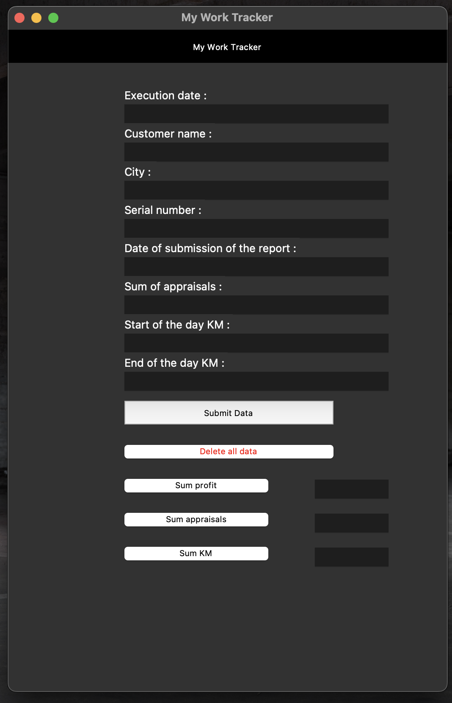

# 🧾 My Work Tracker


**My Work Tracker** is a Python desktop application designed for appraisers to easily track their workday details — from customer visits to appraisal values, driving distance, and more.

It was created as a passion project in 2021 to help someone close to me automate their workflow and reduce hours of monthly manual calculations. This project ended up being my first ever programming experience, and it sparked my path toward studying computer science.

---

## 🧠 Background

This program was inspired by a conversation with an appraiser who logged all her work manually on paper. She needed to record:
- Execution date
- Customer name
- City
- Serial number or ID
- Date of report submission
- Appraisal value
- Start and end of day kilometers

Each month, she would spend hours totaling everything for insurance reports and internal summaries. So I learned Python, Tkinter, and SQLite, and built this app to streamline it all.

---

## 🛠 Features

- 📋 **Data Entry Form**  
  Easily input daily customer and appraisal info into the database via a user-friendly GUI.

- 📆 **Monthly Reports**  
  Choose a month and view:
  - Total appraisal value
  - Total kilometers driven
  - Profit estimation (based on percentage of appraisals)

- 🗑️ **Delete All Data**  
  Clear all entries with a single button (useful for fresh months or tests).

- 💾 **Local Database**  
  Uses SQLite; auto-creates the database table if not already present.

- 📊 **Two Ways to View Data**  
  - Through the built-in monthly summary GUI section  
  - Or via external tools like [DB Browser for SQLite](https://sqlitebrowser.org/)

---

## 🧱 Tech Stack

- **Language**: Python  
- **GUI**: Tkinter  
- **Database**: SQLite  

---

## 💡 Lessons Learned

Creating this app taught me:
- Basics of Python programming
- How to build GUI applications with Tkinter
- How to interact with local databases via SQLite
- Real-world problem-solving for non-technical users

It also showed me how software can make life easier — and it motivated me to pursue a career in tech. 
I'm now a computer science student, and this was the project that started it all!!

---

## 📸 Screenshot



---

## 🚀 How to Run

1. Make sure Python 3 is installed.
2. Clone the repository and navigate into the project folder:
   ```bash
   git clone https://github.com/OrAshry/Work_Tracker.git
   cd Work_Tracker
3. Run the script:
    ```bash
    python3 my_work_tracker.py

---

## 📝 License

This was a personal, non-commercial project — feel free to use or improve it for learning or similar real-world needs.

---

🙌 Acknowledgments

Thanks to the person who inspired this — for sharing a real-world challenge that pushed me to build something meaningful.
